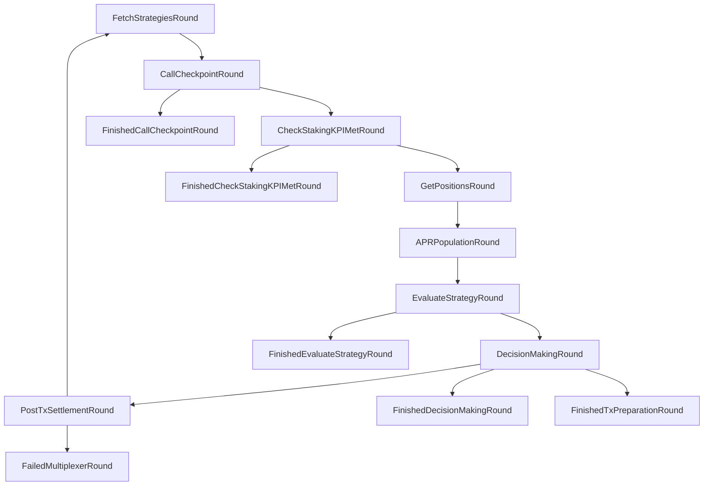
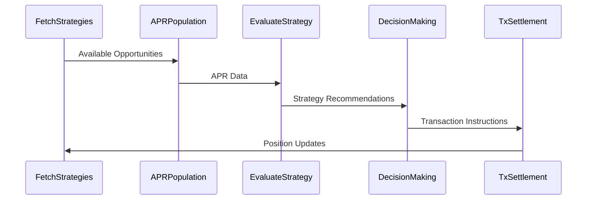

# Optimus/Modius Master Documentation

## Table of Contents

1. [Executive Summary](#executive-summary)
2. [For General Users](#for-general-users)
3. [For Technical Users](#for-technical-users)
4. [Architecture Deep Dive](#architecture-deep-dive)
5. [Configuration & Setup](#configuration--setup)
6. [Data Structures & Models](#data-structures--models)
7. [Integration Points](#integration-points)
8. [Operational Workflows](#operational-workflows)
9. [Troubleshooting & Monitoring](#troubleshooting--monitoring)
10. [Appendices](#appendices)

---

## Executive Summary

### What is Optimus/Modius?

Optimus/Modius is an autonomous liquidity trading system built on the Open Autonomy framework. It operates as an intelligent agent service that automatically identifies and executes profitable liquidity provision opportunities across multiple decentralized exchanges (DEXs) and blockchain networks.

**Key Features:**
- **Autonomous Operation**: Runs 24/7 without human intervention
- **Multi-Chain Support**: Operates across Optimism, Base, Ethereum, and Mode networks
- **Multi-DEX Integration**: Supports Balancer, Uniswap V3, Velodrome, and Sturdy protocols
- **APR-Driven Strategy**: Makes decisions based on Annual Percentage Rate comparisons
- **Risk Management**: Configurable trading strategies (balanced vs risky)
- **Real-time Portfolio Tracking**: Comprehensive position and performance monitoring

### System Benefits

1. **Automated Yield Optimization**: Continuously seeks the highest APR opportunities
2. **Diversified Protocol Exposure**: Spreads risk across multiple DEXs and chains
3. **Transparent Operations**: All transactions and decisions are logged and trackable
4. **Staking Integration**: Built-in Olas staking rewards and KPI tracking
5. **Professional Risk Management**: Sophisticated position sizing and exit strategies

---

## For General Users

### How Optimus/Modius Works

The system operates in **24-hour cycles (epochs)** and follows this general workflow:

1. **Opportunity Scanning**: Searches for liquidity campaigns on the Merkl platform
2. **APR Analysis**: Calculates and compares Annual Percentage Rates across opportunities
3. **Decision Making**: Applies investment criteria and risk parameters
4. **Position Management**: Enters, monitors, and exits liquidity positions
5. **Performance Tracking**: Records all activities and calculates portfolio performance

### Supported Networks & Protocols

#### Blockchain Networks
- **Optimism**: Primary network for operations
- **Base**: Coinbase's Layer 2 network
- **Ethereum**: Mainnet for certain operations
- **Mode**: Emerging Layer 2 network

#### Supported DEXs
- **Balancer**: Weighted and stable pools
- **Uniswap V3**: Concentrated liquidity positions
- **Velodrome**: Both standard and concentrated liquidity pools
- **Sturdy**: Yield aggregation protocol

### Investment Strategy

#### Core Logic
- **Minimum APR Threshold**: 5% annual return required for first investment
- **Comparative Analysis**: Only switches to new opportunities if APR exceeds current position
- **Position Limits**: Manages risk through position sizing and diversification
- **Time-based Decisions**: Minimum holding periods to avoid excessive trading

#### Trading Types
1. **Balanced Trading** (Default)
   - Conservative approach with 33.74% threshold for position changes
   - Focus on stable, proven opportunities
   - Lower risk tolerance

2. **Risky Trading**
   - Aggressive approach with 28.92% threshold
   - Willing to chase higher yields
   - Higher risk tolerance

### Portfolio Management

#### Asset Tracking
The system tracks:
- **Total Portfolio Value**: Combined value across all chains and positions
- **Value in Pools**: Assets actively earning yield
- **Value in Safe**: Idle assets waiting for deployment
- **Initial Investment**: Historical cost basis
- **Volume**: Total trading activity

#### Position Types
- **Open Positions**: Currently active liquidity provisions
- **Closed Positions**: Historical positions for performance tracking
- **Pending Positions**: Positions being entered or exited

### User Interface Features

#### Chat UI Capabilities
- **Portfolio Overview**: Real-time portfolio value and breakdown
- **Position Details**: Individual position performance and status
- **Transaction History**: Complete record of all activities
- **Performance Metrics**: ROI, APR, and other key indicators
- **Configuration Options**: Trading type, risk parameters, and preferences

#### Configurable Parameters
- **Trading Strategy**: Balanced vs Risky
- **Slippage Tolerance**: For swaps and bridging (default 9%)
- **Chain Preferences**: Priority ordering for different networks
- **Asset Whitelist**: Approved tokens for trading

---

## For Technical Users

### System Architecture

Optimus/Modius is built as an **Agent Service** using the Open Autonomy framework, implementing a sophisticated **Finite State Machine (FSM)** architecture with multiple interconnected components.

#### Core Components

1. **Agent Service Layer**
   - Multi-agent coordination
   - Consensus mechanisms
   - Fault tolerance and recovery

2. **Skill Modules**
   - `liquidity_trader_abci`: Core trading logic
   - `optimus_abci`: Application-level coordination
   - Custom protocol integrations

3. **Behavior Patterns**
   - Fetch Strategies
   - APR Population
   - Strategy Evaluation
   - Decision Making
   - Transaction Settlement

### FSM Architecture

#### Liquidity Trader ABCI States



#### Optimus ABCI States

The Optimus ABCI extends the liquidity trader with additional coordination states:

- **RegistrationStartupRound**: Initial agent registration
- **RandomnessTransactionSubmissionRound**: Consensus randomness
- **SelectKeeperTransactionSubmissionRound**: Transaction coordination
- **CollectSignatureRound**: Multi-signature collection
- **FinalizationRound**: Transaction finalization
- **ValidateTransactionRound**: Transaction validation

### Key Modules

#### 1. Fetch Strategies Behavior
**File**: `packages/valory/skills/liquidity_trader_abci/behaviours/fetch_strategies.py`

**Responsibilities**:
- Scans available liquidity opportunities
- Updates position amounts and status
- Calculates portfolio values
- Manages whitelisted assets
- Tracks funding events

**Key Methods**:
- `async_act()`: Main execution loop
- `calculate_user_share_values()`: Portfolio valuation
- `update_position_amounts()`: Position status updates
- `_track_whitelisted_assets()`: Asset filtering based on price changes

#### 2. APR Population Behavior
**File**: `packages/valory/skills/liquidity_trader_abci/behaviours/apr_population.py`

**Responsibilities**:
- Fetches APR data for available opportunities
- Calculates risk-adjusted returns
- Populates strategy database with current rates

#### 3. Strategy Evaluation Behavior
**File**: `packages/valory/skills/liquidity_trader_abci/behaviours/evaluate_strategy.py`

**Responsibilities**:
- Compares current positions with new opportunities
- Applies trading type thresholds
- Determines optimal position sizing

#### 4. Decision Making
**Responsibilities**:
- Final investment decisions
- Risk management application
- Transaction preparation

### Protocol Integrations

#### Custom Pool Search Modules

1. **Uniswap Pools Search**
   - **File**: `packages/valory/customs/uniswap_pools_search/`
   - Concentrated liquidity position management
   - Tick range optimization
   - Fee tier analysis

2. **Balancer Pools Search**
   - **File**: `packages/valory/customs/balancer_pools_search/`
   - Weighted pool analysis
   - Stable pool identification
   - Vault interaction patterns

3. **Velodrome Pools Search**
   - **File**: `packages/valory/customs/velodrome_pools_search/`
   - Both CL and standard pool support
   - Gauge reward calculations
   - Vote-escrowed token considerations

4. **Asset Lending**
   - **File**: `packages/valory/customs/asset_lending/`
   - Sturdy protocol integration
   - Yield aggregation strategies

### Data Flow Architecture



---

## Architecture Deep Dive

### State Machine Specifications

#### Liquidity Trader FSM Events

```yaml
alphabet_in:
- ACTION_EXECUTED
- CHECKPOINT_TX_EXECUTED
- DONE
- ERROR
- NEXT_CHECKPOINT_NOT_REACHED_YET
- NONE
- NO_MAJORITY
- ROUND_TIMEOUT
- SERVICE_EVICTED
- SERVICE_NOT_STAKED
- SETTLE
- STAKING_KPI_MET
- STAKING_KPI_NOT_MET
- UNRECOGNIZED
- UPDATE
- VANITY_TX_EXECUTED
- WAIT
```

#### State Transitions

**FetchStrategiesRound**:
- `DONE` → `CallCheckpointRound`
- `WAIT` → `FetchStrategiesRound` (retry)
- `NO_MAJORITY` → `FetchStrategiesRound` (consensus retry)

**APRPopulationRound**:
- `DONE` → `EvaluateStrategyRound`
- `NONE` → `APRPopulationRound` (retry)

**EvaluateStrategyRound**:
- `DONE` → `DecisionMakingRound`
- `WAIT` → `FinishedEvaluateStrategyRound` (no action needed)

**DecisionMakingRound**:
- `DONE` → `FinishedDecisionMakingRound`
- `SETTLE` → `FinishedTxPreparationRound`
- `ERROR` → `FinishedDecisionMakingRound`

### Round Connections Deep Dive

#### 1. Strategy Discovery Flow
```
FetchStrategiesRound → CallCheckpointRound → CheckStakingKPIMetRound → GetPositionsRound
```

**Purpose**: Initialize the system state and gather current position information.

#### 2. Analysis Flow
```
GetPositionsRound → APRPopulationRound → EvaluateStrategyRound
```

**Purpose**: Analyze available opportunities and compare with current positions.

#### 3. Execution Flow
```
EvaluateStrategyRound → DecisionMakingRound → PostTxSettlementRound
```

**Purpose**: Make investment decisions and execute transactions.

#### 4. Checkpoint Flow
```
CallCheckpointRound → FinishedCallCheckpointRound (if checkpoint needed)
CheckStakingKPIMetRound → FinishedCheckStakingKPIMetRound (if KPI met)
```

**Purpose**: Handle Olas staking requirements and reward claims.

### Selector Metrics Implementation

#### APR Calculation Logic

The system uses multiple APR calculation methods depending on the protocol:

1. **Merkl-based APR**: Direct from campaign data
2. **Historical APR**: Based on past performance
3. **Estimated APR**: Calculated from current pool metrics

#### Selection Criteria

```python
def should_switch_position(current_apr, new_apr, trading_type):
    threshold = THRESHOLDS[trading_type]
    return new_apr > current_apr * (1 + threshold)

# Thresholds:
# Balanced: 33.74% improvement required
# Risky: 28.92% improvement required
```

### Database Operations

#### Persistent Data Storage

The system maintains several data structures:

1. **Current Positions** (`current_positions.json`)
   - Active and closed positions
   - Position metadata and performance

2. **Portfolio Data** (`portfolio.json`)
   - Real-time portfolio valuation
   - Asset breakdown and allocations

3. **Funding Events** (`funding_events.json`)
   - Historical funding transactions
   - Investment tracking across chains

4. **Gas Cost Tracking** (`gas_costs.json`)
   - Transaction cost monitoring
   - Performance optimization data

#### KV Store Integration

The system uses a key-value store for:
- Configuration parameters
- Temporary state data
- Cross-round communication
- Performance metrics

---

## Configuration & Setup

### Environment Variables

#### Required Configuration

```bash
# RPC Endpoints
export ETHEREUM_LEDGER_RPC=<your_ethereum_rpc>
export OPTIMISM_LEDGER_RPC=<your_optimism_rpc>
export BASE_LEDGER_RPC=<your_base_rpc>
export MODE_LEDGER_RPC=<your_mode_rpc>

# Agent Configuration
export ALL_PARTICIPANTS='["<your_agent_address>"]'

# Safe Addresses (Multi-chain)
export SAFE_CONTRACT_ADDRESSES='{
  "ethereum":"<ethereum_safe_address>",
  "optimism":"<optimism_safe_address>",
  "base":"<base_safe_address>",
  "mode":"<mode_safe_address>"
}'

# Trading Parameters
export SLIPPAGE_FOR_SWAP=0.09

# External API Keys
export TENDERLY_ACCESS_KEY=<your_tenderly_key>
export TENDERLY_ACCOUNT_SLUG=<your_tenderly_account>
export TENDERLY_PROJECT_SLUG=<your_tenderly_project>
export COINGECKO_API_KEY=<your_coingecko_key>
```

#### Optional Configuration

```bash
# Trading Strategy
export TRADING_TYPE=balanced  # or "risky"

# Performance Tuning
export SLEEP_TIME=10
export MAX_RETRIES=3
export PORTFOLIO_UPDATE_INTERVAL=21600  # 6 hours
```

### Safe Deployment Requirements

#### Multi-Chain Safe Setup

You need to deploy Gnosis Safes on all supported networks:

1. **Ethereum Mainnet**: For staking and governance operations
2. **Optimism**: Primary trading network
3. **Base**: Secondary trading network
4. **Mode**: Emerging opportunities network

#### Safe Configuration

- **Threshold**: Recommended 1-of-1 for single agent operation
- **Owners**: Your agent address
- **Modules**: No additional modules required
- **Guards**: No guards required

#### Funding Requirements

- **ETH**: Gas fees on all networks (minimum 0.01 ETH per network)
- **USDC**: Trading capital on Ethereum and Optimism
- **Initial Capital**: Minimum $100 equivalent recommended

### API Key Setup

#### Tenderly Configuration

1. Create account at https://dashboard.tenderly.co/
2. Navigate to Settings → API Keys
3. Generate new API key
4. Note your account slug and project slug

**Usage**: Transaction simulation and debugging

#### CoinGecko Configuration

1. Create account at https://www.coingecko.com/
2. Navigate to My Account → Developer's Dashboard
3. Generate API key

**Usage**: Real-time and historical price data

### Network Configuration

#### Contract Addresses

The system interacts with various smart contracts:

**Staking Contracts** (Ethereum):
- Staking Token: `<staking_token_address>`
- Activity Checker: `<activity_checker_address>`

**DEX Contracts** (Per Network):
- Uniswap V3 Position Manager
- Balancer Vault
- Velodrome Position Manager
- Sturdy Vault Contracts

---

## Data Structures & Models

### Position Management

#### Position Data Structure

```json
{
  "pool_address": "0x...",
  "pool_id": "0x...",
  "chain": "optimism",
  "dex_type": "UniswapV3",
  "status": "open",
  "token0": "0x...",
  "token0_symbol": "USDC",
  "token1": "0x...",
  "token1_symbol": "ETH",
  "amount0": 1000000000,
  "amount1": 500000000000000000,
  "current_liquidity": 1234567890,
  "token_id": 12345,
  "apr": 15.5,
  "timestamp": 1640995200,
  "tx_hash": "0x...",
  "enter_timestamp": 1640995200,
  "exit_timestamp": null
}
```

#### Position Status Types

```python
class PositionStatus(Enum):
    OPEN = "open"      # Currently active
    CLOSED = "closed"  # Exited position
```

#### DEX Type Classifications

```python
class DexType(Enum):
    BALANCER = "balancerPool"
    UNISWAP_V3 = "UniswapV3"
    STURDY = "Sturdy"
    VELODROME = "velodrome"
```

### Portfolio Data Model

#### Portfolio Structure

```json
{
  "portfolio_value": 1500.50,
  "value_in_pools": 1200.30,
  "value_in_safe": 300.20,
  "initial_investment": 1000.00,
  "volume": 2500.75,
  "agent_hash": "bafybeig...",
  "allocations": [...],
  "portfolio_breakdown": [...],
  "address": "0x...",
  "last_updated": 1640995200
}
```

#### Allocation Details

```json
{
  "chain": "optimism",
  "type": "uniswapV3",
  "id": "0x...",
  "assets": ["USDC", "ETH"],
  "apr": 15.5,
  "details": "Uniswap V3 Pool - USDC/ETH",
  "ratio": 25.5,
  "address": "0x...",
  "tick_ranges": [
    {
      "current_tick": 195000,
      "tick_lower": 194000,
      "tick_upper": 196000,
      "token_id": 12345,
      "in_range": true
    }
  ]
}
```

#### Portfolio Breakdown

```json
{
  "asset": "USDC",
  "address": "0x...",
  "balance": 1000.50,
  "price": 1.001,
  "value_usd": 1001.50,
  "ratio": 0.667
}
```

### Funding Events Model

#### Event Structure

```json
{
  "mode": {
    "2024-01-15": [
      {
        "from_address": "0x...",
        "amount": 1000.0,
        "token_address": "0x...",
        "symbol": "USDC",
        "timestamp": "2024-01-15T10:30:00Z",
        "tx_hash": "0x...",
        "type": "token"
      }
    ]
  },
  "optimism": {
    "2024-01-16": [...]
  }
}
```

### Gas Cost Tracking

#### Gas Entry Structure

```json
{
  "timestamp": 1640995200,
  "tx_hash": "0x...",
  "gas_used": 150000,
  "gas_price": 20000000000
}
```

### Configuration Models

#### Trading Parameters

```python
class TradingType(Enum):
    BALANCED = "balanced"  # Conservative approach
    RISKY = "risky"       # Aggressive approach

THRESHOLDS = {
    TradingType.BALANCED.value: 0.3374,  # 33.74%
    TradingType.RISKY.value: 0.2892      # 28.92%
}
```

#### Asset Whitelisting

```python
WHITELISTED_ASSETS = {
    "mode": {
        "0x4200000000000000000000000000000000000006": "WETH",
        "0xd988097fb8612cc24eec14542bc03424c656005f": "USDC",
        # ... more assets
    },
    "optimism": {
        "0x0b2c639c533813f4aa9d7837caf62653d097ff85": "USDC",
        "0x94b008aa00579c1307b0ef2c499ad98a8ce58e58": "USDT",
        # ... more assets
    }
}
```

---

## Integration Points

### External APIs

#### CoinGecko Integration

**Purpose**: Price data and market information

**Endpoints Used**:
- Token prices: `/simple/token_price/{platform}`
- Historical prices: `/coins/{id}/history`
- Coin information: `/coins/{id}`

**Rate Limiting**: 20 calls per minute (with API key)

**Implementation**: `packages/valory/skills/liquidity_trader_abci/models.py`

#### Merkl Platform Integration

**Purpose**: Liquidity campaign discovery

**Data Retrieved**:
- Active campaigns
- APR information
- Reward structures
- Campaign duration

#### Blockchain Explorers

**Mode Network**:
- API: `https://explorer-mode-mainnet-0.t.conduit.xyz/api/v2`
- Usage: Transaction history, token transfers

**Optimism Network**:
- API: SafeGlobal API
- Usage: Safe transaction history

#### Tenderly Integration

**Purpose**: Transaction simulation and debugging

**Features**:
- Pre-execution simulation
- Gas estimation
- Error analysis
- Fork testing

### Smart Contract Interactions

#### DEX Protocol Contracts

**Uniswap V3**:
- Position Manager: NFT-based position management
- Pool Contracts: Liquidity and swap operations
- Factory: Pool discovery

**Balancer**:
- Vault: Central liquidity management
- Pool Contracts: Weighted and stable pools
- Gauge System: Reward distribution

**Velodrome**:
- Position Manager: Both CL and standard pools
- Gauge System: Vote-escrowed rewards
- Router: Swap operations

**Sturdy**:
- Vault Contracts: Yield aggregation
- Strategy Contracts: Underlying protocols

#### Staking Contracts

**Olas Staking System**:
- Staking Token: Service registration and rewards
- Activity Checker: KPI monitoring
- Service Registry: Agent coordination

### Cross-Chain Operations

#### Bridge Integration

**LiFi Protocol**:
- Cross-chain asset transfers
- Route optimization
- Slippage protection

**Implementation**:
- Automatic route discovery
- Multi-step execution
- Status monitoring

#### Multi-Chain Coordination

**Safe Synchronization**:
- Balance tracking across chains
- Position consolidation
- Risk management

**State Management**:
- Cross-chain position tracking
- Unified portfolio calculation
- Performance aggregation

---

## Operational Workflows

### Daily Operations (24-Hour Epoch)

#### Phase 1: Initialization (Minutes 0-5)
1. **System Startup**
   - Agent registration and consensus
   - State synchronization
   - Health checks

2. **Data Collection**
   - Fetch current positions
   - Update portfolio values
   - Sync funding events

#### Phase 2: Opportunity Discovery (Minutes 5-15)
1. **Strategy Fetching**
   - Scan Merkl campaigns
   - Identify available pools
   - Filter by whitelisted assets

2. **APR Population**
   - Calculate current APRs
   - Fetch historical performance
   - Update strategy database

#### Phase 3: Analysis (Minutes 15-25)
1. **Strategy Evaluation**
   - Compare opportunities
   - Apply trading type thresholds
   - Calculate position sizes

2. **Risk Assessment**
   - Portfolio diversification check
   - Exposure limits validation
   - Gas cost analysis

#### Phase 4: Decision Making (Minutes 25-35)
1. **Investment Decisions**
   - Select optimal strategies
   - Determine position changes
   - Plan transaction sequence

2. **Transaction Preparation**
   - Build transaction data
   - Simulate execution
   - Prepare signatures

#### Phase 5: Execution (Minutes 35-55)
1. **Transaction Submission**
   - Submit to blockchain
   - Monitor confirmation
   - Handle failures

2. **Settlement**
   - Update position records
   - Calculate performance
   - Log activities

#### Phase 6: Monitoring (Minutes 55-60)
1. **Health Checks**
   - Verify position status
   - Check for errors
   - Update metrics

2. **Preparation for Next Cycle**
   - Clean up temporary data
   - Prepare for next epoch
   - Generate reports

### Strategy Selection Process

#### 1. Opportunity Filtering

```python
def filter_opportunities(campaigns, whitelisted_assets):
    filtered = []
    for campaign in campaigns:
        if campaign.tokens_in_whitelist(whitelisted_assets):
            if campaign.apr >= MIN_APR_THRESHOLD:
                filtered.append(campaign)
    return filtered
```

#### 2. APR Comparison

```python
def compare_strategies(current_position, new_opportunities, trading_type):
    threshold = THRESHOLDS[trading_type]
    current_apr = current_position.apr
    
    for opportunity in new_opportunities:
        if opportunity.apr > current_apr * (1 + threshold):
            return opportunity
    
    return None  # Stay in current position
```

#### 3. Position Sizing

```python
def calculate_position_size(available_capital, risk_parameters):
    max_position_size = available_capital * risk_parameters.max_position_ratio
    min_position_size = risk_parameters.min_position_amount
    
    return max(min_position_size, 
               min(max_position_size, available_capital))
```

### Risk Management Workflows

#### 1. Portfolio Diversification

- **Maximum per DEX**: 40% of total portfolio
- **Maximum per Chain**: 60% of total portfolio
- **Maximum per Asset**: 30% of total portfolio

#### 2. Position Monitoring

- **Daily health checks**: Verify position status
- **APR tracking**: Monitor performance degradation
- **Liquidity monitoring**: Check for zero liquidity positions

#### 3. Emergency Procedures

- **Position closure**: Automatic exit on significant APR drops
- **System pause**: Stop operations on critical errors
- **Safe mode**: Minimal operations during issues

### Performance Tracking

#### 1. Metrics Collection

- **Portfolio Value**: Real-time calculation
- **APR Performance**: Actual vs expected returns
- **Transaction Costs**: Gas usage and optimization
- **Success Rates**: Transaction and strategy success

#### 2. Reporting

- **Daily Reports**: Portfolio status and changes
- **Weekly Summaries**: Performance analysis
- **Monthly Reviews**: Strategy effectiveness

---

## Troubleshooting & Monitoring

### Common Issues

#### 1. Setup Problems

**Issue**: Agent fails to start
**Symptoms**: 
- Service won't initialize
- Connection errors
- Configuration validation failures

**Solutions**:
```bash
# Check environment variables
env | grep -E "(RPC|SAFE|API)"

# Validate Safe addresses
cast call $SAFE_ADDRESS "nonce()" --rpc-url $OPTIMISM_LEDGER_RPC

# Test API connectivity
curl -H "x-cg-api-key: $COINGECKO_API_KEY" \
  "https://api.coingecko.com/api/v3/ping"
```

**Issue**: Insufficient funds
**Symptoms**:
- Transaction failures
- "Insufficient balance" errors
- Positions not opening

**Solutions**:
```bash
# Check balances on all chains
cast balance $SAFE_ADDRESS --rpc-url $ETHEREUM_LEDGER_RPC
cast balance $SAFE_ADDRESS --rpc-url $OPTIMISM_LEDGER_RPC
cast balance $SAFE_ADDRESS --rpc-url $BASE_LEDGER_RPC
cast balance $SAFE_ADDRESS --rpc-url $MODE_LEDGER_RPC

# Check USDC balances
cast call $USDC_ADDRESS "balanceOf(address)" $SAFE_ADDRESS \
  --rpc-url $OPTIMISM_LEDGER_RPC
```

#### 2. Operational Issues

**Issue**: Positions not updating
**Symptoms**:
- Stale position data
- Incorrect portfolio values
- Missing transactions

**Solutions**:
1. Check blockchain connectivity
2. Verify contract addresses
3. Review transaction logs
4. Restart position sync

**Issue**: APR calculation errors
**Symptoms**:
- Unrealistic APR values
- Strategy selection failures
- Performance discrepancies

**Solutions**:
1. Verify price data sources
2. Check historical data accuracy
3. Review calculation logic
4. Update token mappings

#### 3. Performance Issues

**Issue**: High gas costs
**Symptoms**:
- Expensive transactions
- Frequent failures
- Poor profitability

**Solutions**:
1. Optimize transaction timing
2. Batch operations where possible
3. Use gas price oracles
4. Implement gas cost tracking

**Issue**: Slow execution
**Symptoms**:
- Long epoch times
- Delayed responses
- Timeout errors

**Solutions**:
1. Optimize API calls
2. Implement caching
3. Parallel processing
4. Database optimization

### Logging & Debugging

#### Log Levels

```python
# Critical errors that stop operation
logger.error("Failed to fetch strategies: %s", error)

# Important warnings
logger.warning("APR below threshold: %s", apr)

# General information
logger.info("Position opened: %s", position_id)

# Detailed debugging
logger.debug("Transaction data: %s", tx_data)
```

#### Key Log Locations

1. **Agent Logs**: `/logs/agent.log`
2. **Skill Logs**: `/logs/liquidity_trader_abci.log`
3. **Transaction Logs**: `/logs/transactions.log`
4. **Error Logs**: `/logs/errors.log`

#### Debugging Tools

**Tenderly Integration**:
```python
# Simulate transaction before execution
simulation_result = tenderly.simulate_transaction(tx_data)
if simulation_result.success:
    execute_transaction(tx_data)
else:
    logger.error("Simulation failed: %s", simulation_result.error)
```

**Local Testing**:
```bash
# Run agent in debug mode
autonomy deploy run --build-dir abci_build/ --debug

# Check specific behavior
python -m pytest tests/test_fetch_strategies.py -v
```

### Performance Metrics

#### Key Performance Indicators

1. **Portfolio Metrics**
   - Total Value Locked (TVL)
   - Return on Investment (ROI)
   - Sharpe Ratio
   - Maximum Drawdown

2. **Operational Metrics**
   - Transaction Success Rate
   - Average Gas Cost
   - Epoch Completion Time
   - API Response Times

3. **Strategy Metrics**
   - APR Accuracy
   - Position Duration
   - Rebalancing Frequency
   - Risk-Adjusted Returns

#### Monitoring Dashboard

**Portfolio Overview**:
```json
{
  "total_value": 1500.50,
  "daily_change": 25.30,
  "daily_change_percent": 1.71,
  "positions_count": 3,
  "chains_active": ["optimism", "base"],
  "last_update": "2024-01-15T10:30:00Z"
}
```

**Performance Tracking**:
```json
{
  "roi_7d": 2.5,
  "roi_30d": 8.7,
  "roi_90d": 15.2,
  "sharpe_ratio": 1.8,
  "max_drawdown": -3.2,
  "win_rate": 0.75,
  "avg_position_duration": 168,
  "total_transactions": 45
}
```

#### Alert System

**Critical Alerts**:
- Portfolio value drops > 10%
- Position failures
- API connectivity issues
- Staking KPI violations

**Warning Alerts**:
- APR degradation > 20%
- High gas costs
- Slow transaction confirmations
- Asset price volatility

---

## Appendices

### Appendix A: Contract Addresses

#### Ethereum Mainnet
```yaml
staking_token: "0x..."
activity_checker: "0x..."
service_registry: "0x..."
```

#### Optimism
```yaml
uniswap_v3_position_manager: "0xC36442b4a4522E871399CD717aBDD847Ab11FE88"
balancer_vault: "0xBA12222222228d8Ba445958a75a0704d566BF2C8"
velodrome_position_manager: "0x..."
usdc_token: "0x0b2C639c533813f4Aa9D7837CAf62653d097Ff85"
```

#### Base
```yaml
uniswap_v3_position_manager: "0x03a520b32C04BF3bEEf7BF5d56E39E92d51752dd"
balancer_vault: "0xBA12222222228d8Ba445958a75a0704d566BF2C8"
usdc_token: "0x833589fCD6eDb6E08f4c7C32D4f71b54bdA02913"
```

#### Mode
```yaml
velodrome_position_manager: "0x..."
usdc_token: "0xd988097fb8612cc24eec14542bc03424c656005f"
weth_token: "0x4200000000000000000000000000000000000006"
```

### Appendix B: API Endpoints

#### CoinGecko API
```yaml
base_url: "https://api.coingecko.com/api/v3"
endpoints:
  token_price: "/simple/token_price/{platform}"
  historical_price: "/coins/{id}/history"
  coin_info: "/coins/{id}"
rate_limit: "20 calls/minute"
```

#### Merkl Platform
```yaml
base_url: "https://api.merkl.xyz"
endpoints:
  campaigns: "/campaigns"
  pools: "/pools"
  rewards: "/rewards"
```

#### Blockchain Explorers
```yaml
mode_explorer:
  base_url: "https://explorer-mode-mainnet-0.t.conduit.xyz/api/v2"
  endpoints:
    token_transfers: "/addresses/{address}/token-transfers"
    transactions: "/addresses/{address}/transactions"
    
optimism_safe:
  base_url: "https://safe-transaction-optimism.safe.global/api/v1"
  endpoints:
    incoming_transfers: "/safes/{address}/incoming-transfers/"
    transactions: "/safes/{address}/multisig-transactions/"
```

### Appendix C: Key Code Examples

#### Position Management Example

```python
def update_position_status(position, new_liquidity):
    """Update position status based on liquidity changes."""
    if new_liquidity == 0:
        position["status"] = PositionStatus.CLOSED.value
        position["exit_timestamp"] = int(time.time())
    else:
        position["current_liquidity"] = new_liquidity
    
    return position
```

#### APR Calculation Example

```python
def calculate_weighted_apr(positions):
    """Calculate portfolio-weighted APR."""
    total_value = sum(pos["value_usd"] for pos in positions)
    if total_value == 0:
        return 0
    
    weighted_apr = sum(
        pos["apr"] * pos["value_usd"] / total_value 
        for pos in positions
    )
    return weighted_apr
```

#### Risk Management Example

```python
def check_portfolio_limits(portfolio, new_position):
    """Validate portfolio diversification limits."""
    dex_exposure = calculate_dex_exposure(portfolio, new_position.dex_type)
    chain_exposure = calculate_chain_exposure(portfolio, new_position.chain)
    
    if dex_exposure > MAX_DEX_EXPOSURE:
        raise RiskLimitExceeded(f"DEX exposure {dex_exposure} exceeds limit")
    
    if chain_exposure > MAX_CHAIN_EXPOSURE:
        raise RiskLimitExceeded(f"Chain exposure {chain_exposure} exceeds limit")
    
    return True
```

### Appendix D: Glossary

**Agent Service**: An autonomous software service built on the Open Autonomy framework that can make decisions and execute transactions without human intervention.

**APR (Annual Percentage Rate)**: The yearly rate of return on an investment, including compound interest.

**ABCI (Application Blockchain Interface)**: The interface between the consensus engine and the application logic in Tendermint-based systems.

**DEX (Decentralized Exchange)**: A cryptocurrency exchange that operates without a central authority, using smart contracts to facilitate trading.

**FSM (Finite State Machine)**: A computational model consisting of a finite number of states, transitions between those states, and actions.

**Liquidity Provision**: The act of depositing tokens into a liquidity pool to earn fees and rewards.

**Merkl Platform**: A protocol that incentivizes liquidity provision through reward campaigns.

**Position**: An active investment in a liquidity pool or yield farming opportunity.

**Round**: A single step in the FSM execution cycle where agents reach consensus on a specific action or decision.

**Safe (Gnosis Safe)**: A multi-signature wallet that requires multiple signatures to execute transactions.

**Slippage**: The difference between the expected price of a trade and the actual executed price.

**Tick Range**: In Uniswap V3, the price range within which liquidity is provided for concentrated liquidity positions.

**TVL (Total Value Locked)**: The total value of assets deposited in a DeFi protocol.

**Yield Farming**: The practice of earning rewards by providing liquidity or staking tokens in DeFi protocols.

### Appendix E: File Structure Reference

```
optimus/
├── packages/valory/
│   ├── agents/optimus/           # Agent configuration
│   ├── services/optimus/         # Service configuration
│   ├── skills/
│   │   ├── liquidity_trader_abci/    # Core trading logic
│   │   │   ├── behaviours/           # Behavior implementations
│   │   │   ├── states/              # State definitions
│   │   │   ├── models.py            # Data models
│   │   │   └── fsm_specification.yaml
│   │   └── optimus_abci/            # Application coordination
│   └── customs/                     # Custom protocol integrations
│       ├── uniswap_pools_search/
│       ├── balancer_pools_search/
│       ├── velodrome_pools_search/
│       └── asset_lending/
├── data/                        # Runtime data storage
│   ├── portfolio.json
│   ├── funding_events.json
│   └── current_positions.json
├── scripts/                     # Utility scripts
└── tests/                      # Test suite
```

### Appendix F: Environment Setup Checklist

#### Pre-deployment Checklist

- [ ] Python 3.10 installed
- [ ] Poetry installed and configured
- [ ] Docker and Docker Compose installed
- [ ] Open Autonomy framework initialized
- [ ] All required packages synced

#### Configuration Checklist

- [ ] RPC endpoints configured for all chains
- [ ] Safe addresses deployed on all networks
- [ ] Safe addresses funded with ETH and USDC
- [ ] Tenderly API key configured
- [ ] CoinGecko API key configured
- [ ] Agent keys generated and secured

#### Deployment Checklist

- [ ] Environment variables exported
- [ ] Keys.json file created and placed correctly
- [ ] Docker image built successfully
- [ ] Service deployed and running
- [ ] Health checks passing
- [ ] First epoch completed successfully

#### Monitoring Checklist

- [ ] Portfolio tracking functional
- [ ] Position updates working
- [ ] APR calculations accurate
- [ ] Transaction execution successful
- [ ] Logging and alerts configured

---

## Conclusion

This master documentation provides comprehensive coverage of the Optimus/Modius autonomous liquidity trading system. It serves as both an introduction for newcomers and a detailed technical reference for developers and operators.

The system represents a sophisticated approach to automated DeFi yield optimization, combining:

- **Advanced Architecture**: Multi-agent consensus with fault tolerance
- **Cross-Chain Operations**: Unified management across multiple networks
- **Risk Management**: Professional-grade position sizing and diversification
- **Performance Tracking**: Comprehensive monitoring and reporting
- **Extensibility**: Modular design for easy protocol integration

For additional support or questions, refer to the troubleshooting section or consult the development team.

**Document Version**: 1.0  
**Last Updated**: January 2025  
**Maintained By**: Valory Team
