# Optimus/Modius Technical Diagrams

This document contains detailed technical diagrams and flowcharts to complement the master documentation.

## System Architecture Overview

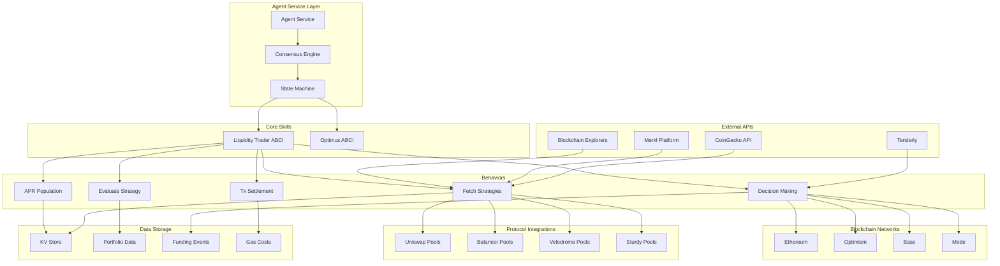

## Finite State Machine Flow

### Liquidity Trader ABCI FSM

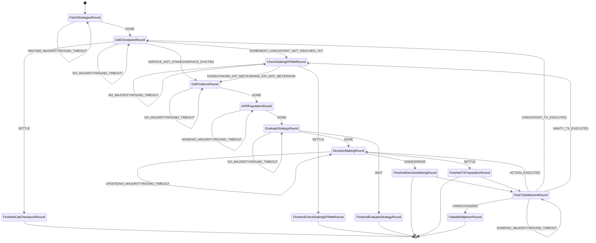

### Optimus ABCI Extended FSM

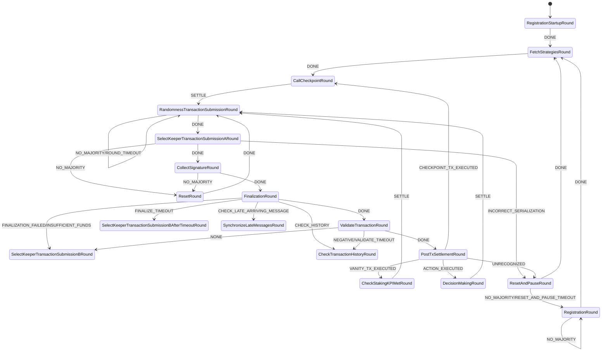

## Data Flow Architecture

### Portfolio Calculation Flow

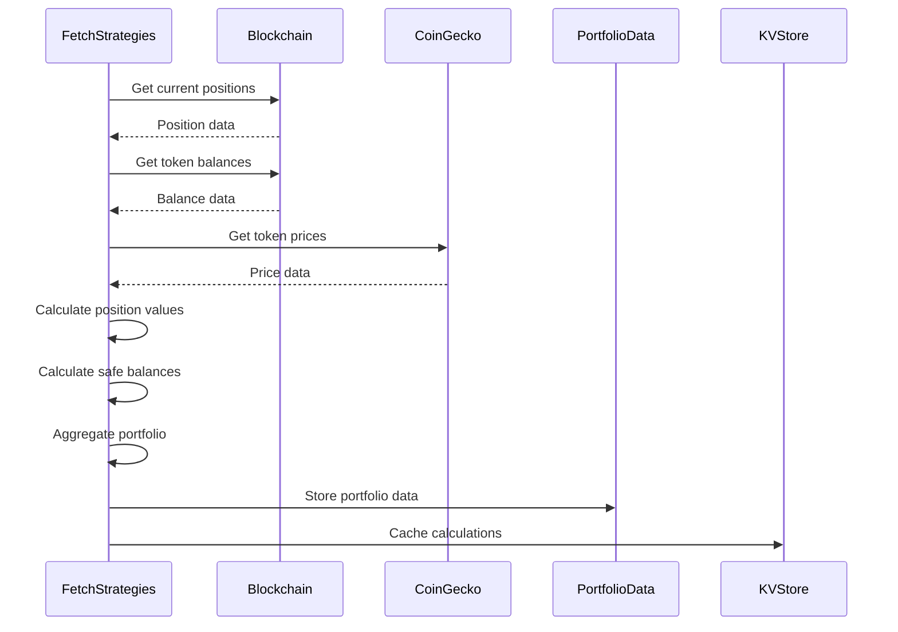

### Strategy Evaluation Flow

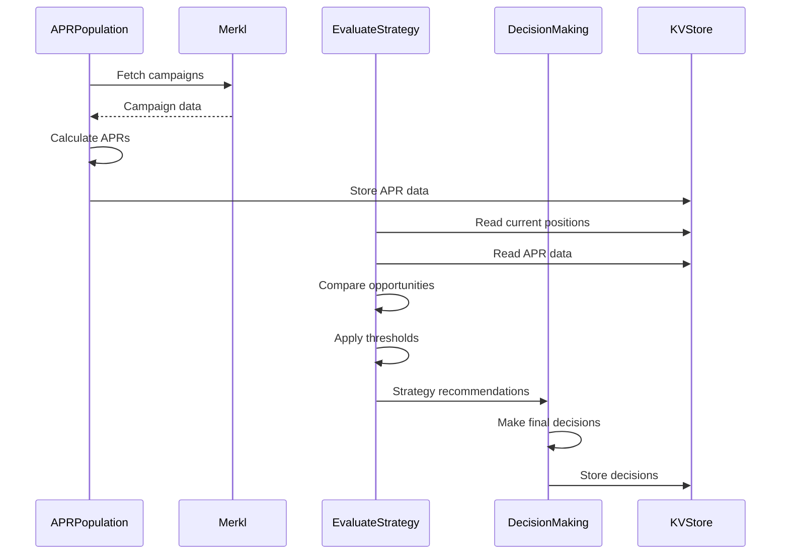

### Transaction Execution Flow

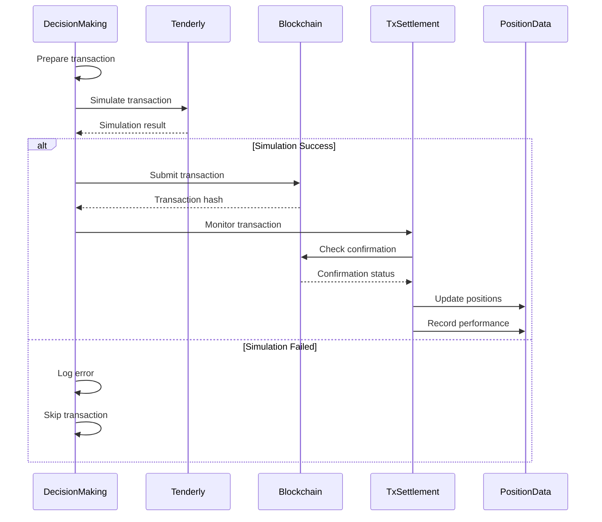

## Protocol Integration Architecture

### DEX Integration Pattern

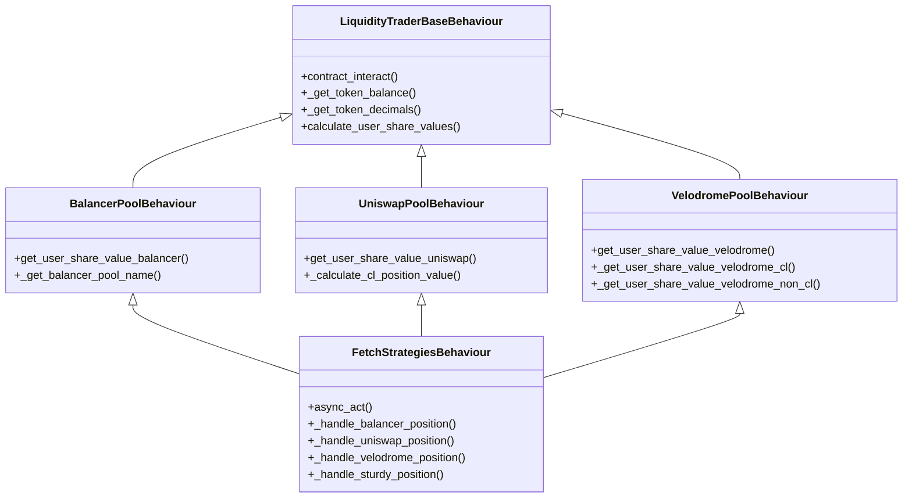

### Position Management Data Model

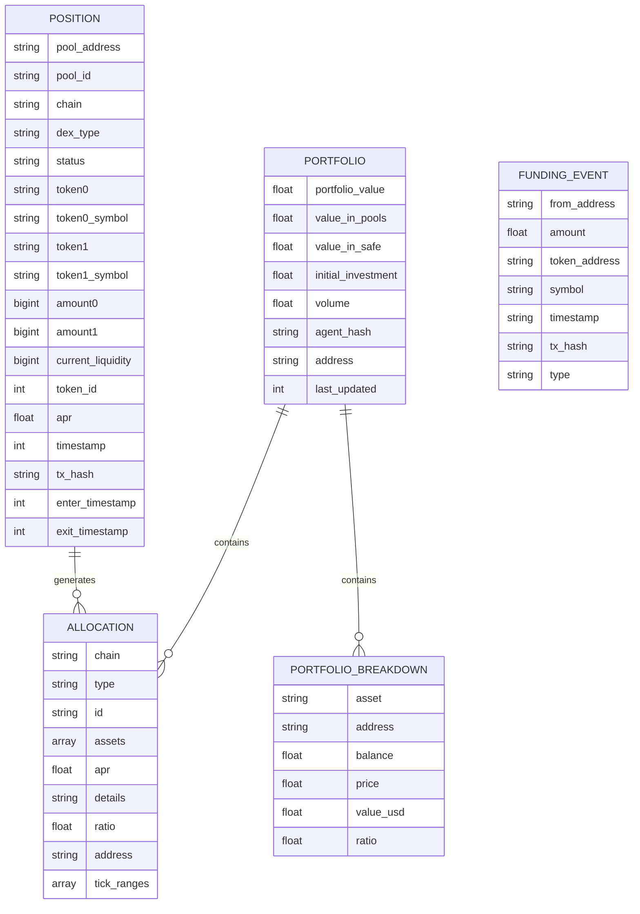

## Risk Management Framework

### Portfolio Diversification Limits

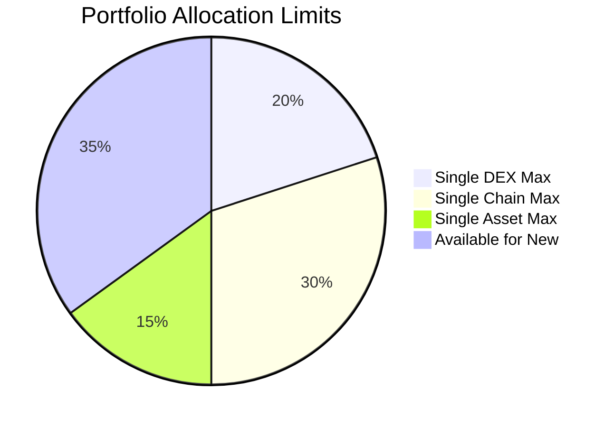

### Decision Making Process

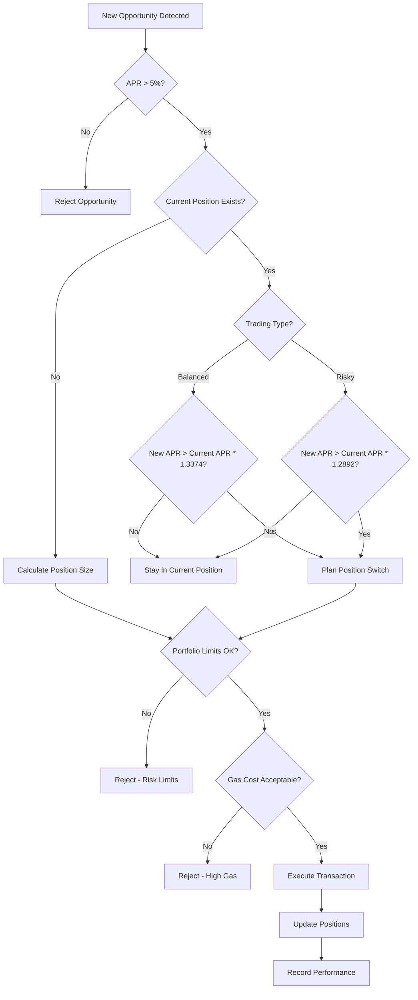

## Multi-Chain Coordination

### Cross-Chain State Management

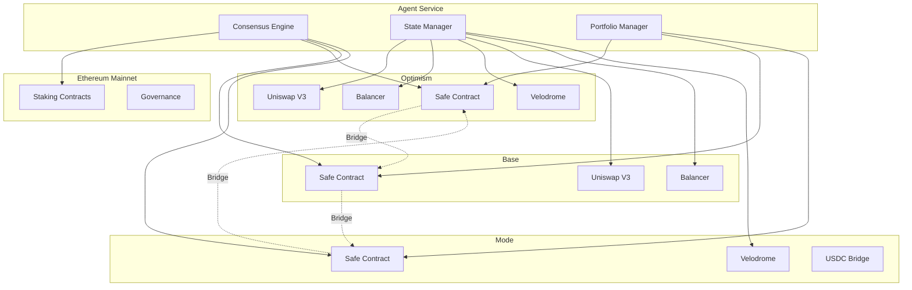

### Asset Flow Diagram

```mermaid
sankey-beta
    USDC,Ethereum,1000
    USDC,Optimism,800
    USDC,Base,150
    USDC,Mode,50
    
    Optimism,Uniswap V3,400
    Optimism,Balancer,250
    Optimism,Velodrome,150
    
    Base,Uniswap V3,100
    Base,Balancer,50
    
    Mode,Velodrome,50
```

## Performance Monitoring Dashboard

### Key Metrics Visualization

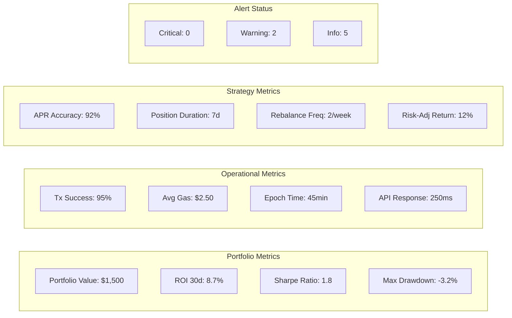

## Deployment Architecture

### Service Deployment Flow

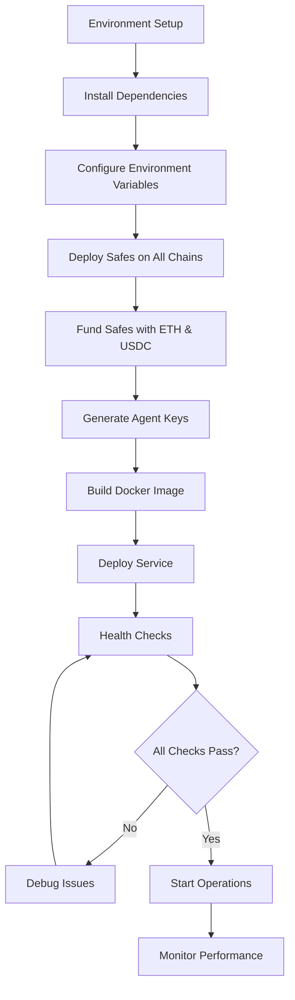

### Container Architecture

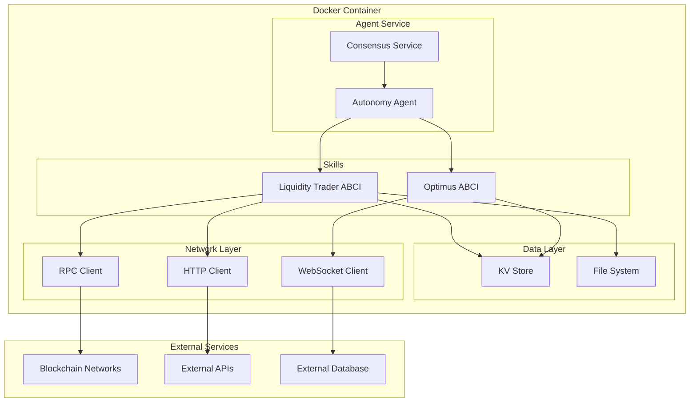

This technical diagrams document provides visual representations of the key architectural components, data flows, and operational processes described in the master documentation. These diagrams help visualize the complex interactions between different system components and provide a clearer understanding of how Optimus/Modius operates.
